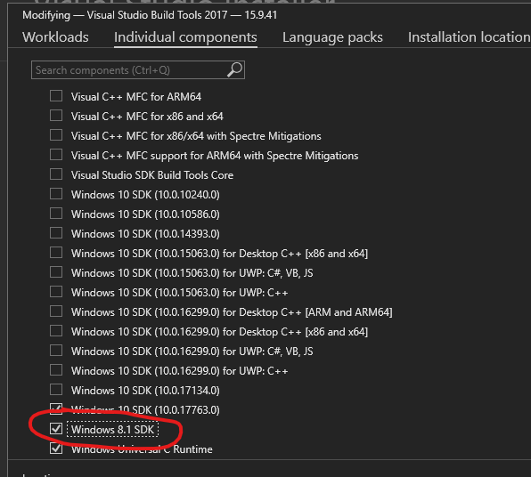
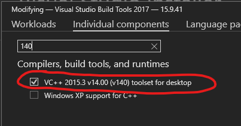

# Aerospike Node.js Client on Windows [![appveyor][appveyor-image]][appveyor-url]

[appveyor-image]: https://ci.appveyor.com/api/projects/status/1pwlt87blqrmgyis/branch/master?svg=true
[appveyor-url]: https://ci.appveyor.com/project/aerospike/aerospike-client-nodejs/

The Aerospike Node.js client port to Windows is a community supported project
and suitable for application prototyping and development.

## Prerequisites

* Windows 7 or later
* Node.js v10.x (LTS) or later

The package includes a native add-on. To compile the add-on, Microsoft's Visual
C++ Build Tools 2015 are required, which you can download from the
[Visual Studio website](https://visualstudio.microsoft.com/vs/older-downloads/).
The required components are:

* Windows 8.1 SDK
* Visual C++ 2015 (v140) Toolset for Desktop

## Aerospike C Client SDK

The Aerospike Node.js client depends on the Aerospike C client. During
installation, a copy of the C client SDK is downloaded and compiled.
Additionally, a set of pre-built, third-party libraries are downloaded and
installed via the
[`aerospike-client-c-dependencies`](https://www.nuget.org/packages/aerospike-client-c-dependencies)
nuget package. Please refer to the [Aerospike C client
documentation](https://github.com/aerospike/aerospike-client-c/tree/master/vs)
for further information.

## Frequently Asked Questions

#### While installing the client, I am getting an error that "build-c-client.ps1 cannot be loaded because running scripts is disabled on this system". What do I need to do?

PowerShell's execution policy prevents you from running the client's installation script. You can temporarily lift the restrictions for the current PowerShell session by running the following command:

    Set-ExecutionPolicy -ExecutionPolicy Unrestricted -Scope Process

For further information, please refer to the PowerShell documentation [About Execution Policies](https://docs.microsoft.com/en-sg/powershell/module/microsoft.powershell.core/about/about_execution_policies).